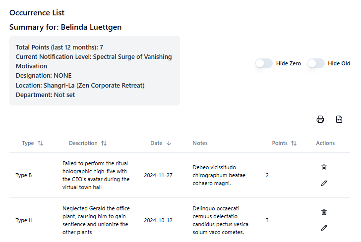
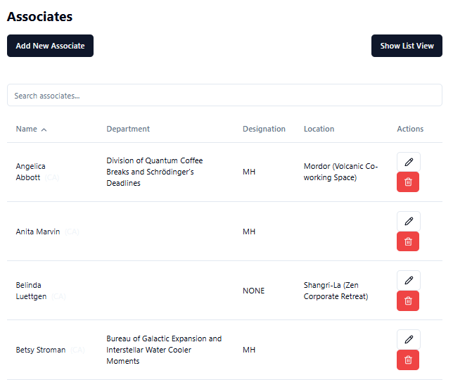
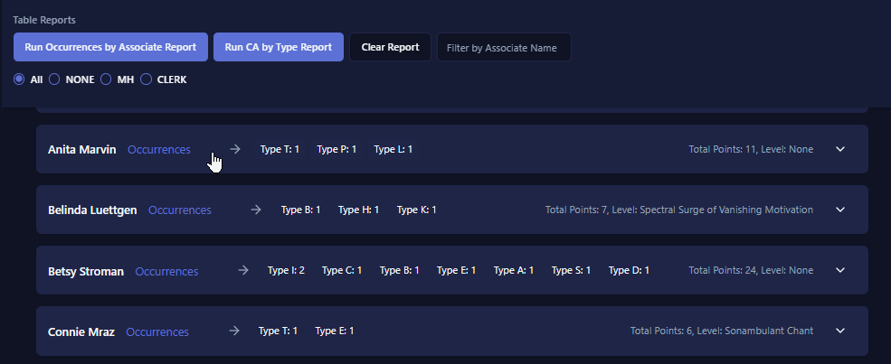

# Associate Management System

## 🚀 Overview

The Associate Management System is a complete web application designed to revolutionize workforce management through efficient tracking of incidents, attendance, and corrective actions. Built with modern web technologies and a focus on user experience, it provides a robust platform for HR professionals and managers to:

- **Streamline Incident Management**: Efficiently track and manage attendance-related incidents with automated point calculations and threshold monitoring.
- **Enhance Compliance**: Maintain detailed records of corrective actions and follow standardized procedures for incident handling.
- **Drive Data-Driven Decisions**: Generate comprehensive reports and analytics to identify patterns and make informed decisions.
- **Ensure Consistency**: Apply standardized rules and procedures across all associate interactions.

The system is built on a solid foundation using Prisma as the ORM with a well-structured data model (detailed in `schema.prisma`). It combines powerful backend capabilities with a responsive, user-friendly frontend to deliver a seamless management experience.

## ✨ Features

### 📊 Occurrence & Associate Management



Track and manage attendance-related incidents with our comprehensive occurrence system. The intuitive interface allows you to:

- Log and categorize attendance incidents
- Track points and thresholds
- Add detailed comments and documentation
- Filter and search through records

### 👥 Associate Records



Maintain detailed associate information in a centralized system:

- Quick associate search and filtering
- Comprehensive profile management
- Historical record tracking
- Department and role organization

### 📈 Advanced Reporting



Generate detailed insights and analytics:

- Customizable report templates
- Excel export functionality
- Trend analysis and visualizations
- Filtered data exports

Additional features include:

- 🖱️ **User-Friendly Interface**: Sleek, responsive design with keyboard navigation support
- 📜 **Rule-Based Corrective Actions**: Automated corrective action management
- 🎨 **Theme Selector**: Multiple theme options including dark mode
- 🔒 **Role-Based Access**: Secure, permission-based system access

## 🛠️ Technologies Used

**Frontend**: React with TypeScript
**Styling**: Tailwind CSS
**UI Components**: Shadcn UI
**Database**: PostgreSQL
**ORM**: Prisma
**API**: (Assuming RESTful API based on the structure, but not explicitly shown)

## 📦 Installation

1. Clone the repository:
   ```
   git clone https://github.com/yourusername/associate-management-system.git
   ```
2. Navigate to the project directory:
   ```
   cd associate-management-system
   ```
3. Install dependencies:
   ```
   npm install
   ```
4. Set up your PostgreSQL database and update the `DATABASE_URL` in your `.env` file.
5. Run Prisma migrations:
   ```
   npx prisma migrate dev
   ```
6. (Optional) Seed data files live under `prisma/`. If you want a **custom** definitions file that is gitignored, copy the sample and edit it; otherwise the seed script will use `prisma/definitions-sample.js` automatically when `prisma/definitions.js` is missing (details in **Seeding the Database** below).
   ```
   cp prisma/definitions-sample.js prisma/definitions.js
   ```
7. (Optional) For associate rows loaded from CSV during a full seed, copy the sample CSV to `prisma/associates.csv`:
   ```
   cp prisma/associates-sample.csv prisma/associates.csv
   ```
8. Seed the database with initial data:
   ```
   npx prisma db seed
   ```
   You can also run the script directly (needed to pass extra flags such as `--associates-only`):
   ```
   node prisma/seed.mjs
   ```
9. Start the development server:
   ```
   npm run dev
   ```

## 🌱 Seeding the Database

Seeding is implemented in `prisma/seed.mjs` and is wired in `package.json` under the Prisma `seed` key, so **`npx prisma db seed`** runs it after migrations when you use `npx prisma migrate reset`, or anytime you want to (re)load sample reference data and associates. You need a working **`DATABASE_URL`** (see `.env`) and applied migrations before seeding.

### Definitions (`prisma/definitions.js`)

Reference data for the seed script includes **notification levels**, **rules**, **occurrence types**, **locations**, and **departments**. That data can come from:

| Source | When it is used |
|--------|------------------|
| `prisma/definitions.js` | If this file exists. It is **gitignored** so each environment can keep its own copy without committing it. |
| `prisma/definitions-sample.js` | If `definitions.js` is **missing**, the seed script logs a short notice and loads the tracked sample file instead. You do **not** have to copy anything for a basic local setup. |

To customize rules, levels, types, locations, or departments for a **full** seed, copy the sample to the gitignored path and edit it:

```
cp prisma/definitions-sample.js prisma/definitions.js
```

The sample exports the same shape the seed expects (`notificationLevels`, `rules`, `occurrenceTypes`, `locations`, `departments`).

### Associates and CSV paths

- **Default associate source for a full seed (no `--use-faker`)**: `prisma/associates.csv`. If the file is missing or empty, associate creation from CSV is skipped (see script output).
- **Sample rows**: `prisma/associates-sample.csv` — copy to `prisma/associates.csv` if you want CSV-driven associates.
- **Faker-generated associates**: use `--use-faker` and optionally `--count` (see below).

### Adding associates only (existing database)

When the database **already** has reference data (occurrence types, locations, departments, rules, etc.) — for example after a restore or a previous full seed — you can **append** associates without maintaining `prisma/definitions.js` and without re-seeding reference tables:

```
node prisma/seed.mjs --associates-only --use-faker --count 25
```

Or from CSV only (uses `prisma/associates.csv`):

```
node prisma/seed.mjs --associates-only
```

Behavior:

- **Skips** upserts for occurrence types, locations, departments, notification levels, and rules.
- For **faker**, location and department names are chosen from **what is already in the database** (if none exist, associates are still created without those links).
- **`--clear` cannot be combined with `--associates-only`** — clear wipes the database, including the reference data this mode assumes is already present.

To pass flags through Prisma’s seed wrapper, use `--` after `db seed`:

```
npx prisma db seed -- --associates-only --use-faker --count 10
```

### Other useful flags

Run **`node prisma/seed.mjs --help`** for the full list. Common options include `--clear` (wipe seeded tables and then regenerate with faker unless combined with other flags), `--use-faker`, `--count`, and scoped flags such as `--occurrences-only`, `--rules-only`, `--users-only`, etc.

### Occurrences from CSV

For a **full** seed without faker, copy the sample if needed and use **`prisma/occurrences.csv`** (same columns as `prisma/occurrences-sample.csv`). The seed script expects: SSO, name, date, code, comment.

Example row shape:

```csv
SSO,name,date,code,comment
332333244,Bob Jones,2024-01-01,c02,Some Reason for the c02
```

Occurrence **codes** must match occurrence types already in the database (from definitions or a prior seed).

### Admin users

Role and admin user seeding is separate: **`npm run prisma:seed-admin`** runs `prisma/seed-admin.mjs` (see that file for defaults).

## 📧 Email Configuration

The application includes email functionality for user registration and password reset. Email setup is **optional** - the application works perfectly without email configuration.

### Quick Start (No Email Setup)
- The application will log email attempts to the console instead of sending them
- Perfect for development and testing
- All functionality works without email services

### Full Email Setup
See [Email Setup Guide](docs/EMAIL_SETUP.md) for complete instructions on configuring Resend for production email delivery.

## 📊 Excel Exports

The system now supports exporting data to Excel files using customizable templates. These templates are stored using UploadThing, a file hosting service.
Setting Up Excel Templates

Create your Excel templates for occurrences and corrective actions.
Upload these templates to UploadThing.
Add the file keys to your .env file:

```
CA_TEMPLATE_KEY=your_ca_template_file_key
OCC_TEMPLATE_KEY=your_occurrence_template_file_key
```

The system will automatically fetch these templates when generating Excel reports, ensuring that you're always using the latest version of your templates without needing to update the application code.

## 🖥️ Usage

After starting the development server, open your browser and navigate to `http://localhost:3000` (or the port specified in your console output).

Use the associate search functionality to find and select associates. You can then view their details, log incidents, or manage their attendance records.

### 🎨 Theme Selection

The application now features a theme selector, allowing users to choose between different visual themes, including a dark mode option. This enhances user experience by providing personalized visual preferences.

## 🤝 Contributing

We welcome contributions to the Associate Management System! Please feel free to submit issues, fork the repository and send pull requests!

## 📄 License

[MIT License](https://opensource.org/licenses/MIT)

## 🔮 Future Plans

- Implement data visualization for attendance trends
- Add role-based access control
- Integrate with external HR systems

---

Built with ❤️ by Some Dude
